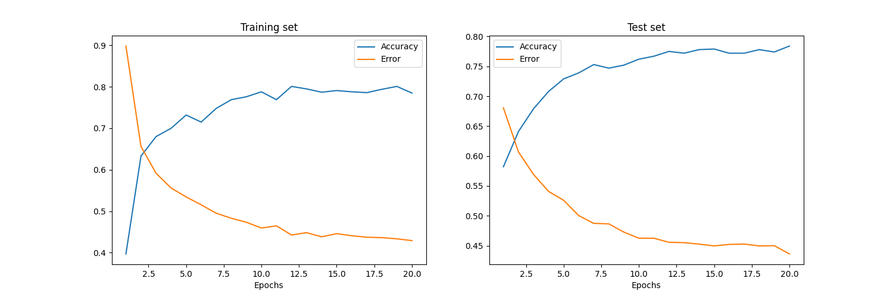

# MNIST手写数字识别教程

本项目是一个使用NumPy实现的简单神经网络，用于手写数字识别。项目使用了MNIST数据集，该数据集包含60,000个训练样本和10,000个测试样本，每个样本是一个28x28像素的手写数字图像。

## 目录

- [介绍](#介绍)
- [安装](#安装)
- [使用](#使用)
- [代码结构](#代码结构)
- [结果展示](#结果展示)

## 介绍

本项目的主要目标是通过简单的神经网络实现手写数字识别。项目使用了以下技术：

- NumPy：用于数值计算。
- Matplotlib：用于绘制训练和测试结果的图表。

## 安装

### 前提条件

- Python 3.6 或更高版本
- 安装所需的Python包：
  ```bash
  pip install numpy matplotlib
  ```

## 使用

1. 确保所有依赖项已安装，并且数据集已正确放置在`_data`目录中。
2. 运行`main.py`文件：
   ```bash
    python main.py
    ```
运行后，程序将训练神经网络并输出每个epoch的训练和测试误差以及准确率。最后，程序将绘制训练和测试集的误差和准确率图表。

## 代码结构

- `main.py`：包含整个项目的代码，包括数据加载、模型定义、训练过程和结果可视化。

### 主要功能

- **数据加载**：从`_data`目录加载MNIST数据集，并进行预处理。
- **模型定义**：定义了一个简单的两层神经网络，使用ReLU激活函数。
- **训练过程**：通过前向传播和反向传播训练神经网络，并使用dropout进行正则化。
- **结果可视化**：使用Matplotlib绘制训练和测试集的误差和准确率图表。

## 结果展示

训练完成后，程序将输出每个epoch的训练和测试误差以及准确率，并绘制以下图表：


